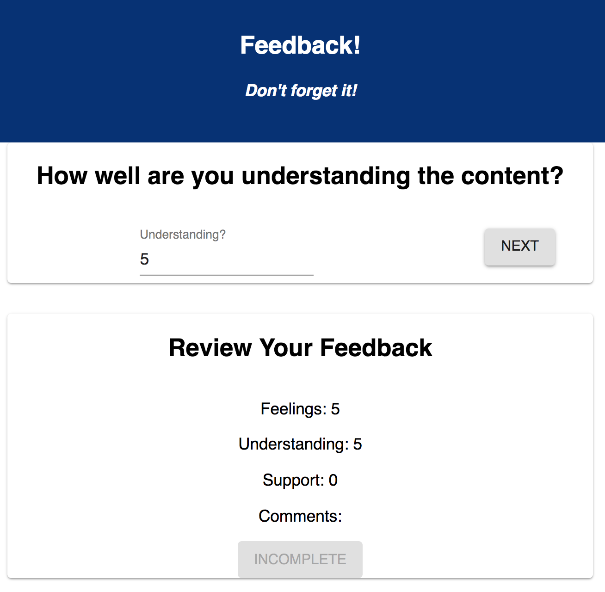

# Redux Feedback Loop
This is an interactive FeedBack app that walks the user through the process of leaving a review.

### SETUP

Create your database and tables using the provided `data.sql` file. Start the server.

```
npm install
npm run server
```

Now that the server is running, open a new terminal tab with `cmd + t` and start the react client app.

```
npm run client
```

### ADD NEW FEEDBACK


There are 4 views for the form parts.
The parts:
-[] How are you feeling today?
    
-[] How well are you understanding the content?
    
-[] How well are you being supported?
    
-[] Any comments you want to leave?
    


## Built With

* React
* Redux
* webpack
* Axios
* Material UI
* postgreSQL
