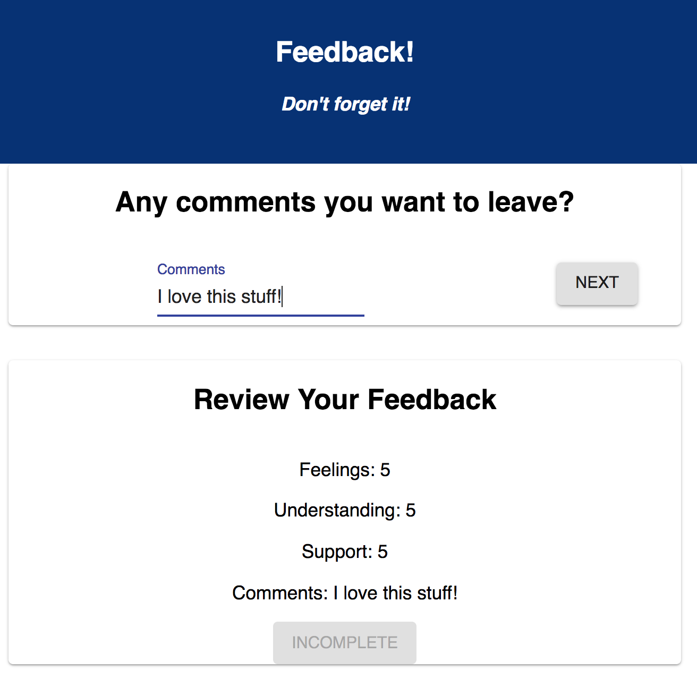

# Redux Feedback Loop
This is an interactive FeedBack app that walks the user through the process of leaving a review.

### SETUP

Create your database and tables using the provided `data.sql` file. Start the server.

```
npm install
npm run server
```

Now that the server is running, open a new terminal tab with `cmd + t` and start the react client app.

```
npm run client
```

### ADD NEW FEEDBACK

> NOTE: As a baseline requirement, you must use Redux to store your data across views.

Create a multi-part form that allows users to leave feedback for today. 
There will be 4 views for the form parts.
The parts:
-[] How are you feeling today?
    
-[] How well are you understanding the content?
    
-[] How well are you being supported?
    
-[] Any comments you want to leave?
    

While there is no nav bar, each part of the form should be at its own route. Clicking next should move the user to the appropriate step in the process as well as update the `Review` Component.


## THE REVIEW COMPONENT

In addition to the multi-step form, the app needs to display the results of each step clearly and at all times. HITN: This will be your current redux values displayed on the DOM. 

The simplest way could be another component on the DOM which shows the results of the current survey and a Submit button.

### Incomplete, Submit button is disabled:


### Survey complete, Submit button is active:


## SUBMIT THE FEEDBACK

## Built With

* React
* Redux
* webpack
* Axios
* Material UI
* postgreSQL
